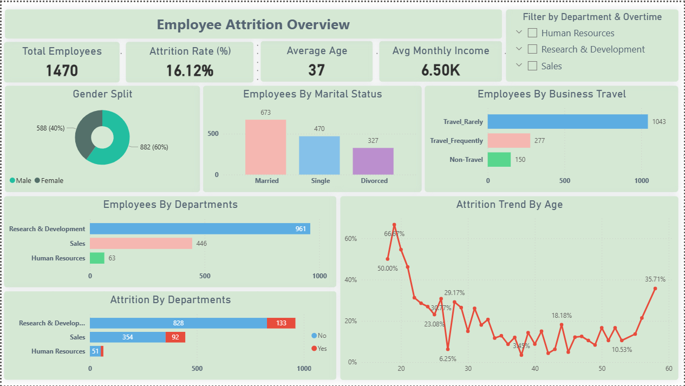
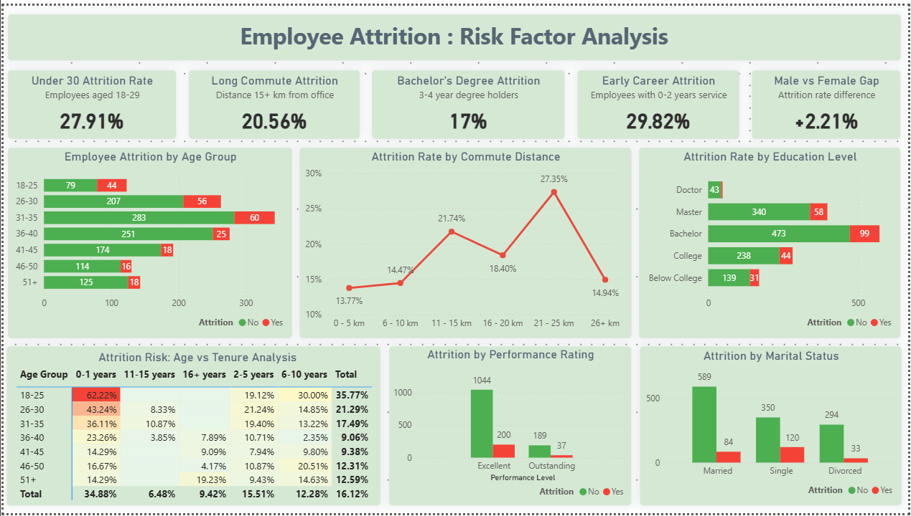

# Employee Attrition Analysis - Power BI Dashboard
Multi-page Power BI dashboard analyzing IBM HR attrition data

## Project Overview
A comprehensive multi-page Power BI dashboard analyzing employee attrition patterns using the IBM HR Analytics Employee Attrition & Performance dataset. This project identifies key risk factors contributing to employee turnover and provides actionable insights for HR retention strategies.

## Dataset Information
- **Source:** IBM HR Analytics Employee Attrition & Performance Dataset
- **Records:** 1,470 employees
- **Features:** 35+ variables including demographics, job roles, satisfaction metrics, and attrition status
- **Target Variable:** Attrition (Yes/No)

## Dashboard Pages

### 1. Employee Attrition Overview
High-level executive summary providing immediate insights into overall attrition patterns.

**Key Metrics:**
- Total Employees: 1,470
- Overall Attrition Rate: 16.12%
- Average Age: 37 years
- Average Monthly Income: $6.50K

**Visualizations:**
1. Gender distribution (donut chart)
2. Marital status breakdown (column chart)
3. Business travel frequency analysis (horizontal bar chart)
4. Department-wise employee count (stacked bar chart)
5. Department-wise attrition comparison (stacked bar chart)
6. Age-based attrition trend (line chart showing 66.67% peak at age 20)

**Interactive Features:**
- Department filter (Human Resources, Research & Development, Sales)
- Overtime filter

### 2. Employee Attrition - Risk Factor Analysis
Deep-dive analysis identifying specific employee segments with elevated attrition risk.

**Risk Factor KPIs:**
1. Under 30 Attrition Rate: **27.91%** (employees aged 18-29)
2. Long Commute Attrition: **20.56%** (distance 15+ km from office)
3. Bachelor's Degree Attrition: **17%** (3-4 year degree holders)
4. Early Career Attrition: **29.82%** (employees with 0-2 years service)
5. Male vs Female Gap: **+2.21%** (attrition rate difference)

**Visualizations:**
1. **Employee Attrition by Age Group** (stacked bar chart)
   - Shows clear inverse relationship between age and attrition
   - Youngest group (18-25) has highest risk at 35.77%

2. **Attrition Rate by Commute Distance** (line chart)
   - Peak attrition at 21-25 km distance (27.35%)
   - Lowest attrition for employees living 0-5 km (13.77%)

3. **Attrition Rate by Education Level** (stacked bar chart)
   - Bachelor's degree holders show 17.3% attrition
   - Doctoral employees have lowest attrition at 6.5%

4. **Attrition Risk: Age vs Tenure Analysis** (heat map matrix)
   - Highest risk: 18-25 age group with 0-1 year tenure (62.22%)
   - Shows stabilization effect after 10+ years of service
   - Color-coded cells (green = low risk, red = high risk)

5. **Attrition by Performance Rating** (clustered column chart)
   - Compares Excellent vs Outstanding performers
   - Performance rating shows minimal impact on attrition

6. **Attrition by Marital Status** (clustered column chart)
   - Single employees: 22-25% attrition
   - Married employees: 12-13% attrition (best retention)
   - Divorced employees: 15-18% attrition (moderate)

## Key Business Insights

### Critical Findings:
1. **Early Career Crisis:** 29.82% of employees with 0-2 years leave - highest risk factor
2. **Young Talent Flight:** 27.91% attrition for under-30 employees, significantly above 16.12% average
3. **First Year Critical:** 34.88% overall attrition in first year (from heat map)
4. **Distance Matters:** Commute over 15km increases attrition by approximately 27%
5. **Marital Stability:** Married employees show approximately 50% lower attrition than single employees
6. **Age-Tenure Intersection:** Young employees (18-25) in their first year show catastrophic 62.22% attrition

### Surprising Patterns:
- Bachelor's degree holders have higher attrition (17.3%) than Master's (14.6%) - counterintuitive
- Performance rating is NOT a major differentiator in attrition rates
- Very long commutes (26+ km) show moderate attrition (14.94%) - employees who choose distant living accept it
- Sales department shows highest attrition across the organization

